# Construindo um Projeto com Arquitetura Baseada em Microsserviços Usando Spring Cloud


## 🇧🇷 Português

## Visão Geral

Este projeto demonstra a implementação de uma arquitetura de microsserviços robusta e escalável utilizando o ecossistema Spring Cloud. Ele serve como um guia prático para construir aplicações distribuídas, abordando conceitos essenciais como descoberta de serviços, configuração centralizada e roteamento de API.

### Tecnologias Utilizadas


### Estrutura do Projeto

O projeto é composto pelos seguintes módulos principais:

*   **`api-gateway`**: Atua como o ponto de entrada unificado para todos os clientes, roteando requisições para os microsserviços apropriados e fornecendo funcionalidades como autenticação e balanceamento de carga.
*   **`config-server`**: Centraliza a gestão das configurações de todos os microsserviços, permitindo atualizações dinâmicas sem a necessidade de reiniciar as aplicações.
*   **`service-discovery`**: Implementa o padrão de descoberta de serviços (Eureka Server), onde os microsserviços se registram e são descobertos por outros serviços e pelo API Gateway.

### Diagrama de Arquitetura

Abaixo está um diagrama que ilustra a arquitetura de microsserviços implementada neste projeto:

```mermaid
graph TD
    Client(["👤 Cliente\n(Browser / App / REST Client)"])

    subgraph Infrastructure ["Infraestrutura Spring Cloud"]
        Gateway["🌐 API Gateway\n(Spring Cloud Gateway)\n:8080"]
        Discovery["🔍 Service Discovery\n(Eureka Server)\n:8761"]
        Config["⚙️ Config Server\n(Spring Cloud Config)\n:8888"]
    end

    subgraph Services ["Microsserviços de Negócio"]
        SvcA["📦 Microservice A\n(Eureka Client)"]
        SvcB["📦 Microservice B\n(Eureka Client)"]
        SvcN["📦 Microservice N\n(Eureka Client)"]
    end

    Client -->|"HTTP Request"| Gateway
    Gateway -->|"Resolve rota via registro"| Discovery
    Gateway -->|"Encaminha requisição"| SvcA
    Gateway -->|"Encaminha requisição"| SvcB
    Gateway -->|"Encaminha requisição"| SvcN

    SvcA -->|"Registra / Heartbeat"| Discovery
    SvcB -->|"Registra / Heartbeat"| Discovery
    SvcN -->|"Registra / Heartbeat"| Discovery

    SvcA -->|"Busca configuração"| Config
    SvcB -->|"Busca configuração"| Config
    SvcN -->|"Busca configuração"| Config
    Gateway -->|"Busca configuração"| Config

    Config -.->|"Inicia antes de tudo"| Discovery
    Discovery -.->|"Inicia antes do Gateway"| Gateway

    style Client fill:#4A90D9,stroke:#2C5F8A,color:#fff
    style Gateway fill:#6DB33F,stroke:#4a7c2a,color:#fff
    style Discovery fill:#FF6F00,stroke:#b84f00,color:#fff
    style Config fill:#007ACC,stroke:#005a9e,color:#fff
    style SvcA fill:#6DB33F,stroke:#4a7c2a,color:#fff
    style SvcB fill:#6DB33F,stroke:#4a7c2a,color:#fff
    style SvcN fill:#6DB33F,stroke:#4a7c2a,color:#fff
    style Infrastructure fill:#f0f4f8,stroke:#c0ccd8
    style Services fill:#f0f9f0,stroke:#b0d4b0
```




### Pré-requisitos

Para executar este projeto, você precisará ter instalado:

*   Java Development Kit (JDK) 11 ou superior
*   Maven 3.6.3 ou superior
*   Docker (opcional, para conteinerização)

### Como Executar

Siga os passos abaixo para configurar e executar o projeto:

1.  **Clonar o Repositório:**

    ```bash
    git clone https://github.com/galafis/Construindo-um-Projeto-com-Arquitetura-Baseada-em-Microsservi-os-Usando-Spring-Cloud.git
    cd Construindo-um-Projeto-com-Arquitetura-Baseada-em-Microsservi-os-Usando-Spring-Cloud
    ```

2.  **Compilar o Projeto:**

    Navegue até o diretório raiz do projeto e compile todos os módulos:

    ```bash
    mvn clean install
    ```

3.  **Iniciar os Microsserviços (em ordem):**

    Abra terminais separados para cada microsserviço e inicie-os na seguinte ordem:

    *   **Config Server:**

        ```bash
        cd src/config-server
        mvn spring-boot:run
        ```

    *   **Service Discovery (Eureka Server):**

        ```bash
        cd src/service-discovery
        mvn spring-boot:run
        ```

    *   **API Gateway:**

        ```bash
        cd src/api-gateway
        mvn spring-boot:run
        ```

    *   **Outros Microsserviços (se houver):**

        Inicie quaisquer outros microsserviços de negócio que você adicionar ao projeto.

### Exemplos de Uso

Após iniciar todos os serviços, você pode acessar:

*   **Eureka Dashboard:** `http://localhost:8761`
*   **Config Server:** `http://localhost:8888`
*   **API Gateway:** `http://localhost:8080`

Para testar o roteamento do API Gateway, você precisaria de um microsserviço de exemplo registrado no Eureka. Por exemplo, se você tivesse um serviço chamado `my-service`:

`http://localhost:8080/my-service/api/data`

### Licença

Este projeto está licenciado sob a Licença MIT. Veja o arquivo [LICENSE](LICENSE) para mais detalhes.

### Contribuições

Contribuições são bem-vindas! Sinta-se à vontade para abrir issues e pull requests.

---

## 🇬🇧 English

## Overview

This project demonstrates the implementation of a robust and scalable microservices architecture using the Spring Cloud ecosystem. It serves as a practical guide to building distributed applications, covering essential concepts such as service discovery, centralized configuration, and API routing.

### Technologies Used


### Project Structure

The project consists of the following main modules:

*   **`api-gateway`**: Acts as the unified entry point for all clients, routing requests to the appropriate microservices and providing functionalities such as authentication and load balancing.
*   **`config-server`**: Centralizes the management of configurations for all microservices, allowing dynamic updates without the need to restart applications.
*   **`service-discovery`**: Implements the service discovery pattern (Eureka Server), where microservices register themselves and are discovered by other services and the API Gateway.

### Architecture Diagram

Below is a diagram illustrating the microservices architecture implemented in this project:

```mermaid
graph TD
    Client(["👤 Client\n(Browser / App / REST Client)"])

    subgraph Infrastructure ["Spring Cloud Infrastructure"]
        Gateway["🌐 API Gateway\n(Spring Cloud Gateway)\n:8080"]
        Discovery["🔍 Service Discovery\n(Eureka Server)\n:8761"]
        Config["⚙️ Config Server\n(Spring Cloud Config)\n:8888"]
    end

    subgraph Services ["Business Microservices"]
        SvcA["📦 Microservice A\n(Eureka Client)"]
        SvcB["📦 Microservice B\n(Eureka Client)"]
        SvcN["📦 Microservice N\n(Eureka Client)"]
    end

    Client -->|"HTTP Request"| Gateway
    Gateway -->|"Resolve route via registry"| Discovery
    Gateway -->|"Forwards request"| SvcA
    Gateway -->|"Forwards request"| SvcB
    Gateway -->|"Forwards request"| SvcN

    SvcA -->|"Register / Heartbeat"| Discovery
    SvcB -->|"Register / Heartbeat"| Discovery
    SvcN -->|"Register / Heartbeat"| Discovery

    SvcA -->|"Fetch configuration"| Config
    SvcB -->|"Fetch configuration"| Config
    SvcN -->|"Fetch configuration"| Config
    Gateway -->|"Fetch configuration"| Config

    Config -.->|"Starts before everything"| Discovery
    Discovery -.->|"Starts before Gateway"| Gateway

    style Client fill:#4A90D9,stroke:#2C5F8A,color:#fff
    style Gateway fill:#6DB33F,stroke:#4a7c2a,color:#fff
    style Discovery fill:#FF6F00,stroke:#b84f00,color:#fff
    style Config fill:#007ACC,stroke:#005a9e,color:#fff
    style SvcA fill:#6DB33F,stroke:#4a7c2a,color:#fff
    style SvcB fill:#6DB33F,stroke:#4a7c2a,color:#fff
    style SvcN fill:#6DB33F,stroke:#4a7c2a,color:#fff
    style Infrastructure fill:#f0f4f8,stroke:#c0ccd8
    style Services fill:#f0f9f0,stroke:#b0d4b0
```




### Prerequisites

To run this project, you will need to have the following installed:

*   Java Development Kit (JDK) 11 or higher
*   Maven 3.6.3 or higher
*   Docker (optional, for containerization)

### How to Run

Follow the steps below to set up and run the project:

1.  **Clone the Repository:**

    ```bash
    git clone https://github.com/galafis/Construindo-um-Projeto-com-Arquitetura-Baseada-em-Microsservi-os-Usando-Spring-Cloud.git
    cd Construindo-um-Projeto-com-Arquitetura-Baseada-em-Microsservi-os-Usando-Spring-Cloud
    ```

2.  **Build the Project:**

    Navigate to the project root directory and build all modules:

    ```bash
    mvn clean install
    ```

3.  **Start the Microservices (in order):**

    Open separate terminals for each microservice and start them in the following order:

    *   **Config Server:**

        ```bash
        cd src/config-server
        mvn spring-boot:run
        ```

    *   **Service Discovery (Eureka Server):**

        ```bash
        cd src/service-discovery
        mvn spring-boot:run
        ```

    *   **API Gateway:**

        ```bash
        cd src/api-gateway
        mvn spring-boot:run
        ```

    *   **Other Microservices (if any):**

        Start any other business microservices you add to the project.

### Usage Examples

After starting all services, you can access:

*   **Eureka Dashboard:** `http://localhost:8761`
*   **Config Server:** `http://localhost:8888`
*   **API Gateway:** `http://localhost:8080`

To test API Gateway routing, you would need an example microservice registered with Eureka. For instance, if you had a service named `my-service`:

`http://localhost:8080/my-service/api/data`

### License

This project is licensed under the MIT License. See the [LICENSE](LICENSE) file for more details.

### Contributions

Contributions are welcome! Feel free to open issues and pull requests.

